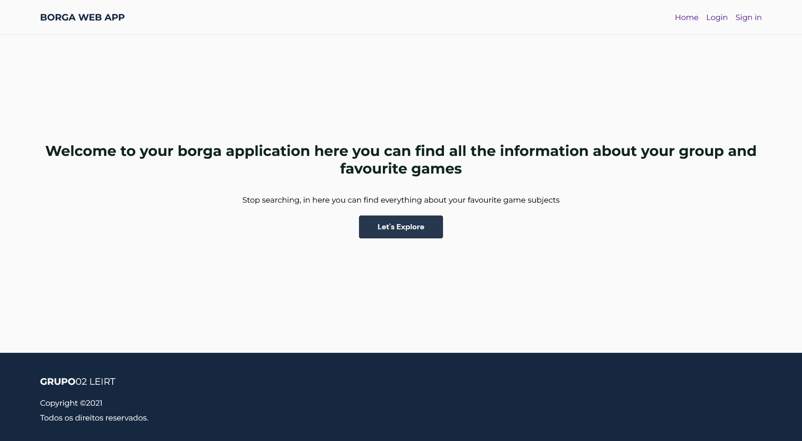

<h1 align="center"> Board Games Atlas Web App </h1>

<p align="center">
This project was developed during the Internet programming course.
</p>

<p align="center">
  <a href="#technologies">Technologies</a>&nbsp;&nbsp;&nbsp; |&nbsp;&nbsp;&nbsp;
  <a href="#project">Project</a>&nbsp;&nbsp;&nbsp; |&nbsp;&nbsp;&nbsp;
  <a href="#running-the-application">Running the Application</a>&nbsp;&nbsp;&nbsp; |&nbsp;&nbsp;&nbsp;
  <a href="#memo-license">License</a>
</p>

<p align="center">
  
</p>

<br>

<p align="center">
  
</p>

## Technologies

This project was developed with the following technologies:

- JavaScript
- Node.js
- Express
- ElasticSearch
- Passport
- HTML
- CSS
- HandleBars
- Jest
- Git
- GitHub

## Project

The project's main goal was to design a web application that would allow users to create their own board game playlists. The application has an authentication system so that each user can have an individual experience while navigating through a simple interface that uses the Board Game Atlas API as a source of information.

## Running the Application

1.  **Necessary installations**

    ```shell
    # Create package.json
      npm init –y

    # Module that brings Fetch API to node
      npm install node-fetch

    # Framework express
      npm install express

    # Middlewares
      npm install express-session
      npm install passport

    # Extension to read and use the template engines in the web-site
      npm install handlebars

    # Support for the tests
      npm install jest --save-dev
      npm install supertest --save-dev
    ```

2.  **Run Tests**

    The next step is to open the package.json and change the test property to "jest" in the scripts object. So now we are ready to run the tests of the application. <br>
    Navigate into your new site’s directory and start it up.

    ```shell
      npm run test
    ```

3.  **Choose How to store data.**

    You should open the borga-server.js file and comment the option that you **don’t** want.

    ```shell
    # Memory
      const borgaData = require('./borga-data-mem.js')

    # ElasticSearch
      const borgaData = require('./borga-db.js')
    ```

4.  **ElasticSearch**

    If you choosed the db option, the application is gonna use ElasticSearch, so it will be necessary a previous installation of the package but also to execute some commands in the shell to create the documents necessary to support the application. Also, if you don't have Curl might consider installing it for managing your accounts in the application.

    <a href="https://www.elastic.co/pt/downloads/elasticsearch" target="_blank">Install ElasticSearch</a><br/>
    <a href="https://curl.se/download.html" target="_blank">Install Curl</a>

    ```shell
    # Start ElasticSearch
      elasticsearch

    # Delete to prevent data overlap
      curl -X DELETE http://localhost:9200/users
      curl -X DELETE http://localhost:9200/groups

    # Insert both documents in curl
      curl -X PUT http://localhost:9200/users
      curl -X PUT http://localhost:9200/groups

    # Create an admin account
      curl -X POST --data "{\"userName\" : \"admin\", \"password\" : \"admin\", \"token\" :\"3fa85f64-5717-4562-b3fc-2c963f66afa6\" }" -H "Content-Type: application/json"             http://localhost:9200/users/_doc

    # Create a group for the admin
      curl -X POST --data "{\"name\" : \"MyGroup\",  \"description\" : \"Administration Group\", \"games\" : [], \"userName\" : \"admin\" }" -H  "Content-Type: application/json"       http://localhost:9200/groups/_doc
    ```

5.  **Start application**

    Open the shell in the applications directory and start it up!

    ```shell
      node borga-server.js
    ```

    Your site is now running at <a href="https://curl.se/download.html" target="_blank">http://localhost:8080</a>

## :memo: License

This project is under the MIT License.

---

Developed by [Tiago Cebola](https://github.com/TiagoCebola) & [Gustavo Campos](https://github.com/gustavodev1998) & [Inês Sampaio](https://github.com/inessampaio), belonging to the LEIRT61D class at ISEL. :wave:
